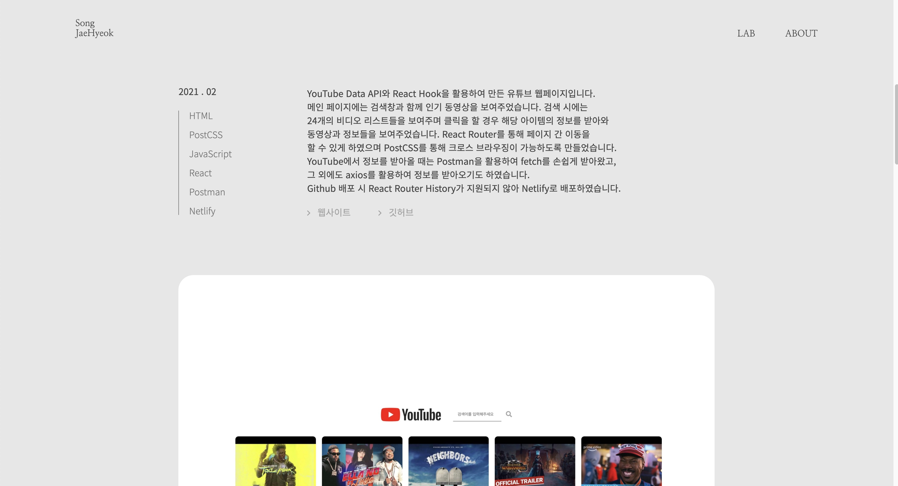
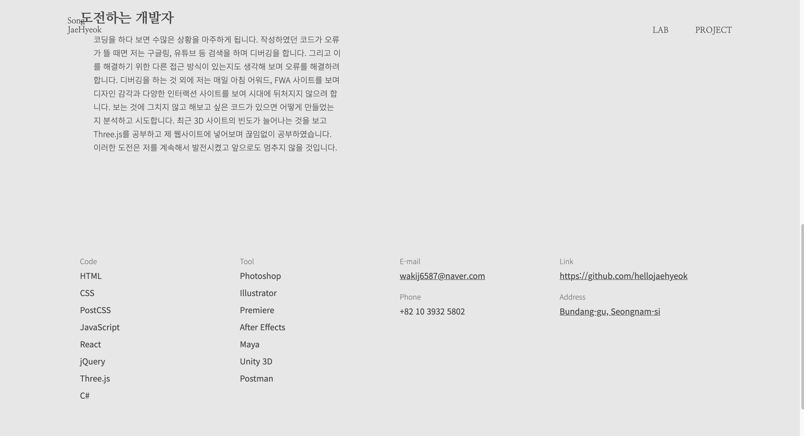

# portfolio_2021

2021년 포트폴리오 웹사이트입니다.      
이전에 만든 포트폴리오 사이트의 문제점을 생각하며 기획, 디자인, 개발을 하였습니다.    
웹 프로젝트를 중점적으로 보여주기위하여 유니티, 뉴미디어부분의 프로젝트는 넣지 않았습니다.   
일러스트레이터로 먼저 레이아웃을 잡고 코딩을 통해 웹상에 구현하였습니다.     

## 사용 언어
 - HTML, CSS, JavaScript, jQuery 

### 중점 작업  
1. 모든 사이트를 미디어 쿼리와 display: flex; 를 사용하여 반응형 웹페이지로 제작하였습니다.      
2. jQuery를 활용하여 더 간결한 코드를 작성하였습니다.     
3. 웹표준을 준수하며 마크업하였습니다.     

## 웹사이트 구성

### Main Page

화면 중앙에 프로젝트 썸네일과 제목을 배치하였고 하단에는 사용 언어를 적었습니다.  
스크롤을 하거나 우측에 위치한 버튼을 누르면 다음 프로젝트를 보여줍니다.
프로젝트를 클릭 시 썸네일이 커지며 화면을 채운 후 링크로 이동하도록 만들었습니다.   
이를 구현하기 위하여 클릭하였을 때 border-radius와 width, height 값을 조절하였습니다.
해당 링크로 바로 넘어가는것을 막기 위하여 preventDefault()를 사용하였고,
setTimeout 을 사용하여 일정 시간이 지난 후 이동되도록 만들었습니다.

CSS

    section > ul > li > a > div{width: 30vw; height: 30vw; border-radius: 50%;}
    section > ul > li.click_project > a > div{width: 100vw; height: 100vh; border-radius: 0;}

JavaScript

    function active_fullscreen (e){
        e.preventDefault();
        const el = e.currentTarget;
        title_list.eq(cur_title).addClass("click_project");
        order_wrap.addClass("click_project");
        setTimeout(()=>{
            location.href = el.getAttribute("href");
        }, 1000)
    }

헤더에는 lab, about 페이지로 갈수있는 네비게이션과 로고를 넣었습니다.

### Project Page

프로젝트 페이지입니다. 유튜브, 인터스텔라, 포트폴리오2020, 아모레퍼시픽, 비밀의 숲이 있습니다.      
프로젝트 커버, 설명, 이미지 순서로 보여주었으며 전체적인 레이아웃은 통일시켰습니다.     
하단에는 다음 프로젝트의 간단한 소개와 함께 넘어갈 수 있도록 하였고,     
푸터에는 저의 정보를 입력하여 연락할 수 있게 제작하였습니다.     

### About Page

제 프로필 페이지입니다.     
크게 두 개의 단락으로 나누었고 위쪽에는 제 소개를 아래에는 저의 연락처 및 정보를 기재하였습니다.     

### Lab Page

Three.js를 활용하여 제작하였던 여러 작업들을 모아둔 곳입니다.     
메인 페이지와 다르게 리스트 형식으로 볼 수 있게 하였고 이미지 옆에는 간단한 소개와 함께     
사이트, 깃허브 링크를 연결해 놓았습니다.     

송재혁입니다.
감사합니다.
